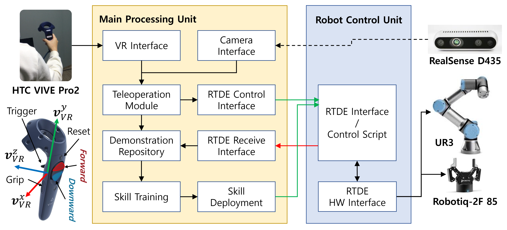
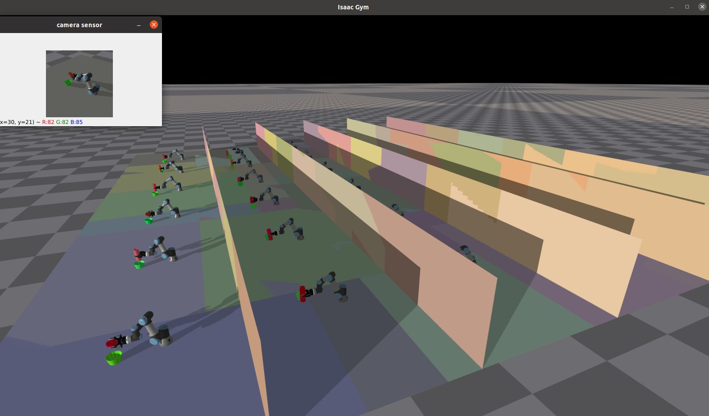
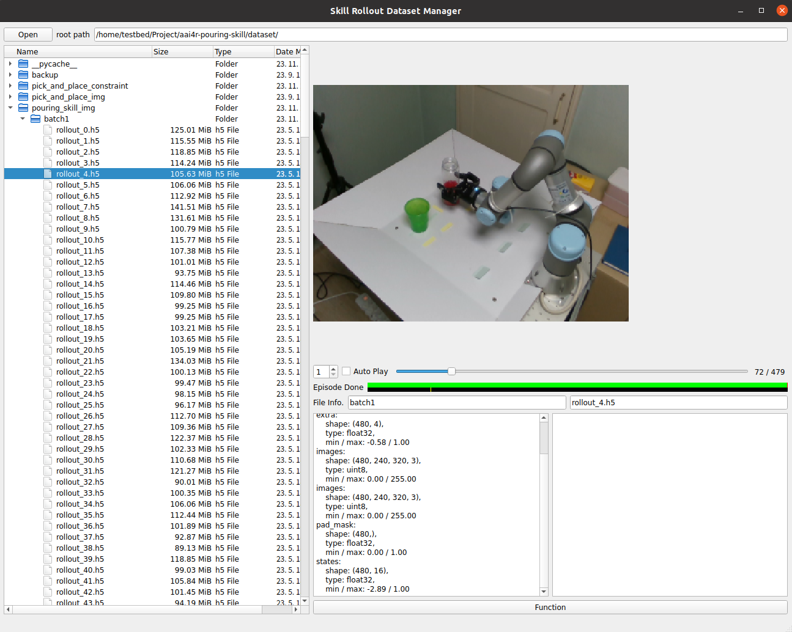
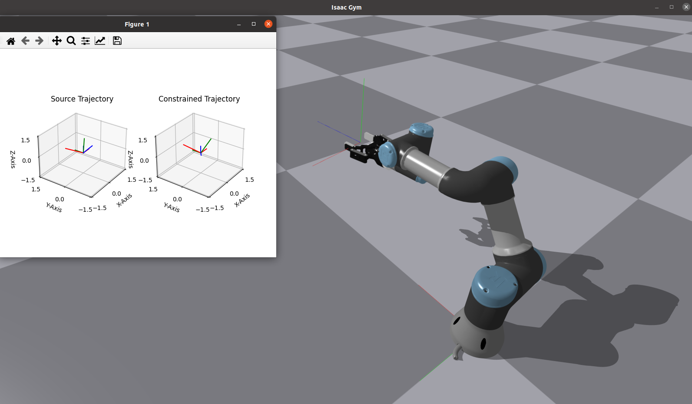

# Learning manipulation skills from Human demonstration
This is our on-going project for learning manipulation skills from human demonstration.

## Overall System


## Required Hardware
* UR3
* HTC-VIVE Pro2
* RealSense D435 x 2
* Robotiq 2F-85

## Tested Environment
* Ubuntu 20.04 and 22.04
* python 3.8 >=

## Installation
```commandline
pip install -r requirements.txt
```

* steam: https://store.steampowered.com/about/
* Isaac Gym preview-release 4 must be installed in advance ([Download](https://developer.nvidia.com/isaac-gym))
* VR libs: https://github.com/ankurhanda/HTC-Vive-Setup-Ubuntu
* steamVR
* openvr
* triad_openvr (openvr wrapper)
* sudo apt install libsdl2-dev


## Manipulation Skill Learning Framework
* Our learning framework is mainly based on SPiRL[[1]](#1) ([code](https://github.com/clvrai/spirl)).
### Skill Learning Process from Human Demonstration
1) Human Demonstration dataset collection using VR Teleoperation
2) Skill Learning
3) Skill Correction and Enhancement by Shared Autonomy Process

## Dataset Generation from GPU-accelerated Parallel Environment


* To generate the demonstration dataset, run following command
```commandline
cd task_rl/
python collect_experience.py
```
* The generated demonstration dataset can be found in dataset/{TASK_NAME}


## Dataset
Our demonstration dataset is accessible via Google drive:
https://drive.google.com/drive/folders/1lKXeFPIOF-kFaDk7mrzxcbKWtLMORgqx?usp=drive_link

## Dataset Viewer UI


* We provide dataset viewer which is created by PyQt.
* Run following command to open the dataset viewer and select rollout_N.h5 file in the batch folder.

```commandline
cd dataset/
python dataset_manager_gui.py 
```

## VR Teleoperation Test using Isaac Gym

* Before run following command, HTC-VIVE controller must be activated.

```commandline
cd vr_teleop/
python vr_teleop_main.py
```

## References
<a id="1">[1]</a> 
K. Pertsch, Y. Lee, and J. Lim, “Accelerating reinforcement learning
with learned skill priors,” in Conference on robot learning. PMLR,
2021, pp. 188–204.